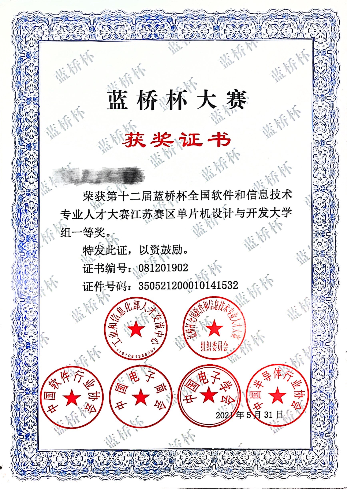
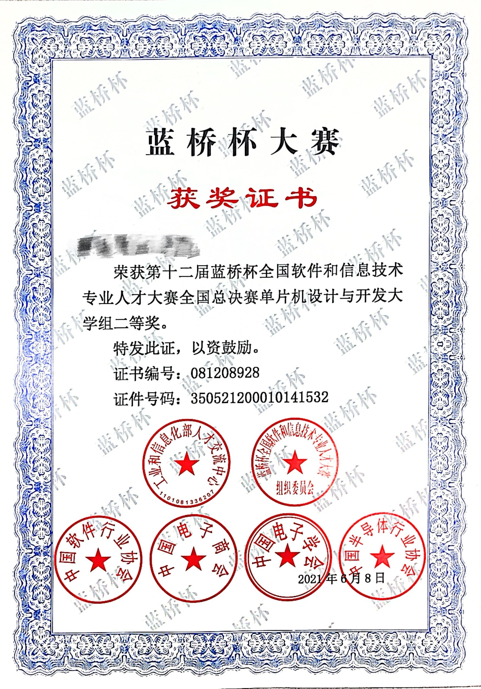

# LanQiaoCup（蓝桥杯）

LanQiaoCup module program example and standard template

> 笔者在本科大二期间，参加了2021年蓝桥杯单片机设计与开发组省赛，获省赛一等奖成功入围决赛，并获全国总决赛二等奖（证书见文末）。

## 本仓库提供了：
- 蓝桥杯大赛涉及的各个模块驱动编写及使用方法（DS18B20、DS1302、PCF8591、AT24C02、PWM、串口通信、NE555以及超声波测距）以及通用标准模版
- 赛点资源数据包
- 历年省赛、国赛官方真题
- 《“蓝桥杯”全国软件和信息技术专业人才大赛（电子类）实训指导书》.pdf

## 具体各个模块都提供了非常详细的讲解，可参照下文：
- [蓝桥杯单片机设计与开发标准模版](https://joker001014.github.io/blog/001_Lanqiaobei)
- [蓝桥杯单片机设计与开发_基础模块_DS18B20](https://joker001014.github.io/blog/002_Lanqiaobei)
- [蓝桥杯单片机设计与开发_基础模块_DS1302](https://joker001014.github.io/blog/003_Lanqiaobei)
- [蓝桥杯单片机设计与开发_基础模块_PCF8591](https://joker001014.github.io/blog/004_Lanqiaobei)
- [蓝桥杯单片机设计与开发_基础模块_AT24C02](https://joker001014.github.io/blog/005_Lanqiaobei)
- [蓝桥杯单片机设计与开发_基础模块_PWM](https://joker001014.github.io/blog/006_Lanqiaobei)
- [蓝桥杯单片机设计与开发_基础模块_串口通信](https://joker001014.github.io/blog/007_Lanqiaobei)
- [蓝桥杯单片机设计与开发_基础模块_NE555](https://joker001014.github.io/blog/008_Lanqiaobei)
- [蓝桥杯单片机设计与开发_基础模块_超声波测距](https://joker001014.github.io/blog/009_Lanqiaobei)

ps若无法科学上网的同学，可参考 CSDN 博文（与上述个人博客内容一致）：
- [蓝桥杯单片机设计与开发标准模版](https://blog.csdn.net/weixin_53159274/article/details/116534261?spm=1001.2014.3001.5501)
- [蓝桥杯单片机设计与开发_基础模块_DS18B20](https://blog.csdn.net/weixin_53159274/article/details/116643908?spm=1001.2014.3001.5501)
- [蓝桥杯单片机设计与开发_基础模块_DS1302](https://blog.csdn.net/weixin_53159274/article/details/133819071?spm=1001.2014.3001.5501)
- [蓝桥杯单片机设计与开发_基础模块_PCF8591](https://blog.csdn.net/weixin_53159274/article/details/133954632?spm=1001.2014.3001.5501)
- [蓝桥杯单片机设计与开发_基础模块_AT24C02](https://blog.csdn.net/weixin_53159274/article/details/133955197?spm=1001.2014.3001.5501)
- [蓝桥杯单片机设计与开发_基础模块_PWM](https://blog.csdn.net/weixin_53159274/article/details/134255799?spm=1001.2014.3001.5501)
- [蓝桥杯单片机设计与开发_基础模块_串口通信](https://blog.csdn.net/weixin_53159274/article/details/134256374?spm=1001.2014.3001.5501)
- [蓝桥杯单片机设计与开发_基础模块_NE555](https://blog.csdn.net/weixin_53159274/article/details/134627755?spm=1001.2014.3001.5501)
- [蓝桥杯单片机设计与开发_基础模块_超声波测距](https://blog.csdn.net/weixin_53159274/article/details/134627803?spm=1001.2014.3001.5501)

## 附录：证书

